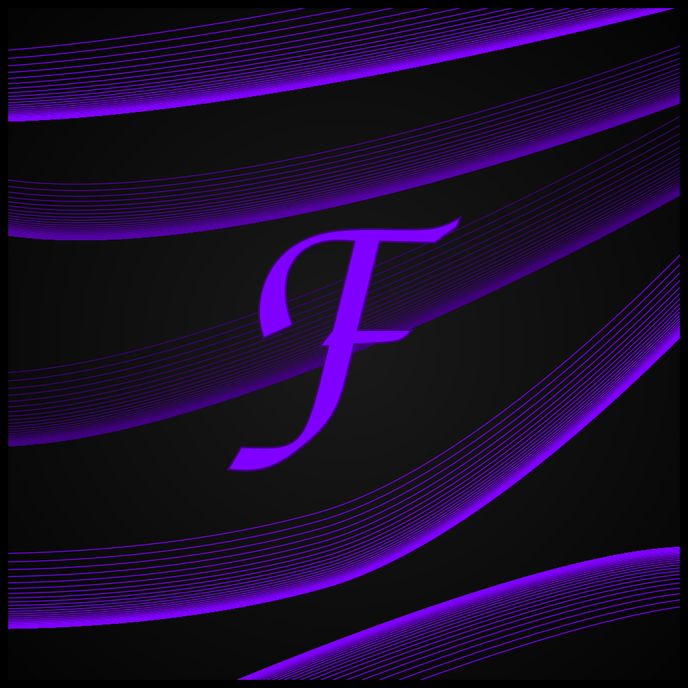

<a name="readme-top"></a>

[![Contributors][contributors-shield]][contributors-url]
[![Forks][forks-shield]][forks-url]
[![Stargazers][stars-shield]][stars-url]
[![Issues][issues-shield]][issues-url]
[![MIT License][license-shield]][license-url]

<!-- PROJECT LOGO -->
<br />
<div align="center">
  <a href="https://github.com/HyScript7/fvWeb">
    
  </a>

<h3 align="center">fvWeb</h3>

  <p align="center">
    The official website for Fusionverse
    <br />
    <a href="https://github.com/HyScript7/fvWeb"><strong>Explore the docs »</strong></a>
    <br />
    <br />
    <a href="https://github.com/HyScript7/fvWeb">View Demo</a>
    ·
    <a href="https://github.com/HyScript7/fvWeb/issues">Report Bug</a>
    ·
    <a href="https://github.com/HyScript7/fvWeb/issues">Request Feature</a>
  </p>
</div>

<!-- TABLE OF CONTENTS -->
<details>
  <summary>Table of Contents</summary>
  <ol>
    <li>
      <a href="#about-the-project">About The Project</a>
      <ul>
        <li><a href="#built-with">Built With</a></li>
      </ul>
    </li>
    <li>
      <a href="#getting-started">Getting Started</a>
      <ul>
        <li><a href="#prerequisites">Prerequisites</a></li>
        <li><a href="#installation">Installation</a></li>
      </ul>
    </li>
    <li><a href="#usage">Usage</a></li>
    <li><a href="#roadmap">Roadmap</a></li>
    <li><a href="#contributing">Contributing</a></li>
    <li><a href="#license">License</a></li>
    <li><a href="#contact">Contact</a></li>
    <li><a href="#acknowledgments">Acknowledgments</a></li>
  </ol>
</details>

<!-- ABOUT THE PROJECT -->

## About The Project

[![Product Name Screen Shot][product-screenshot]](https://example.com)

fvWeb is the official website for [Fusionverse](https://discord.gg/Nj4ScwhnXD), written with SolidJS and FastAPI.

<p align="right">(<a href="#readme-top">back to top</a>)</p>

### Built With

- [![Python][Python.org]][Python-url]
- [![FastAPI][FastAPI.com]][FastAPI-url]
- [![Postgres][Postgres.org]][Postgres-url]
- [![SolidJS][SolidJS.com]][SolidJS-url]
- [![TailwindCSS][Tailwindcss.com]][Tailwindcss-url]
- [![DaisyUI][DaisyUI.com]][DaisyUI-url]

<p align="right">(<a href="#readme-top">back to top</a>)</p>

<!-- GETTING STARTED -->

## Getting Started

To get a local (development) copy up and running follow the following steps.

For production deployments, see docker-compose.yml.

> **Dockerfiles may not be present in the repository yet**

### Prerequisites

- [node.js](https://nodejs.org/en)
- [npm](https://www.npmjs.com/) or [pnpm](https://pnpm.io/)
- [python](https://python.org)
- [poetry](https://python-poetry.org/)

### Installation

1. Clone the repo
   ```sh
   git clone https://github.com/HyScript7/fvWeb.git
   ```

<p align="right">(<a href="#readme-top">back to top</a>)</p>

<!-- USAGE EXAMPLES -->

## Usage

Use this space to show useful examples of how a project can be used. Additional screenshots, code examples and demos work well in this space. You may also link to more resources.

_For more examples, please refer to the [Documentation](https://example.com)_

<p align="right">(<a href="#readme-top">back to top</a>)</p>

<!-- ROADMAP -->

## Roadmap

- [ ] Authentication
  - [ ] Authorization
- [ ] User Profiles
- [ ] Wiki
- [ ] Forum
- [ ] Blog
- [ ] Custom Pages
- [ ] Searching
- [ ] Admin

See the [open issues](https://github.com/HyScript7/fvWeb/issues) for a full list of proposed features (and known issues).

<p align="right">(<a href="#readme-top">back to top</a>)</p>

<!-- CONTRIBUTING -->

## Contributing

Contributions are what make the open source community such an amazing place to learn, inspire, and create. Any contributions you make are **greatly appreciated**.

If you have a suggestion that would make this better, please fork the repo and create a pull request. You can also simply open an issue with the tag "enhancement".
Don't forget to give the project a star! Thanks again!

1. Fork the Project
2. Create your Feature Branch (`git checkout -b feature/AmazingFeature`)
3. Commit your Changes (`git commit -m 'Add some AmazingFeature'`)
4. Push to the Branch (`git push origin feature/AmazingFeature`)
5. Open a Pull Request

<p align="right">(<a href="#readme-top">back to top</a>)</p>

<!-- LICENSE -->

## License

Distributed under the MIT License. See `LICENSE.md` for more information.

<p align="right">(<a href="#readme-top">back to top</a>)</p>

<!-- CONTACT -->

## Contact

HyScript7 - [@hyscript7](https://twitter.com/hyscript7) - hyscript7@gmail.com

Project Link: [https://github.com/HyScript7/fvWeb](https://github.com/HyScript7/fvWeb)

<p align="right">(<a href="#readme-top">back to top</a>)</p>

<!-- ACKNOWLEDGMENTS -->

## Acknowledgments

- [README Template](https://github.com/othneildrew/Best-README-Template/)
- [Markdown Badges](https://ileriayo.github.io/markdown-badges/)
- [IDE Gitignore](https://salesforce.stackexchange.com/questions/321725/gitignore-for-various-ides)

<p align="right">(<a href="#readme-top">back to top</a>)</p>

<!-- MARKDOWN LINKS & IMAGES -->
<!-- https://www.markdownguide.org/basic-syntax/#reference-style-links -->

[contributors-shield]: https://img.shields.io/github/contributors/HyScript7/fvWeb.svg?style=for-the-badge
[contributors-url]: https://github.com/HyScript7/fvWeb/graphs/contributors
[forks-shield]: https://img.shields.io/github/forks/HyScript7/fvWeb.svg?style=for-the-badge
[forks-url]: https://github.com/HyScript7/fvWeb/network/members
[stars-shield]: https://img.shields.io/github/stars/HyScript7/fvWeb.svg?style=for-the-badge
[stars-url]: https://github.com/HyScript7/fvWeb/stargazers
[issues-shield]: https://img.shields.io/github/issues/HyScript7/fvWeb.svg?style=for-the-badge
[issues-url]: https://github.com/HyScript7/fvWeb/issues
[license-shield]: https://img.shields.io/github/license/HyScript7/fvWeb.svg?style=for-the-badge
[license-url]: https://github.com/HyScript7/fvWeb/blob/master/LICENSE.txt
[product-screenshot]: images/screenshot.png
[SolidJS.com]: https://img.shields.io/badge/SolidJS-2c4f7c?style=for-the-badge&logo=solid&logoColor=c8c9cb
[SolidJS-url]: https://www.solidjs.com/
[Tailwindcss.com]: https://img.shields.io/badge/tailwindcss-%2338B2AC.svg?style=for-the-badge&logo=tailwind-css&logoColor=white
[Tailwindcss-url]: https://tailwindcss.com/
[DaisyUI.com]: https://img.shields.io/badge/daisyui-5A0EF8?style=for-the-badge&logo=daisyui&logoColor=white
[DaisyUI-url]: https://daisyui.com/
[Python.org]: https://img.shields.io/badge/python-3670A0?style=for-the-badge&logo=python&logoColor=ffdd54
[Python-url]: http://python.org/
[FastAPI.com]: https://img.shields.io/badge/FastAPI-005571?style=for-the-badge&logo=fastapi
[FastAPI-url]: https://fastapi.tiangolo.com/
[Postgres.org]: https://img.shields.io/badge/postgres-%23316192.svg?style=for-the-badge&logo=postgresql&logoColor=white
[Postgres-url]: https://www.postgresql.org/
